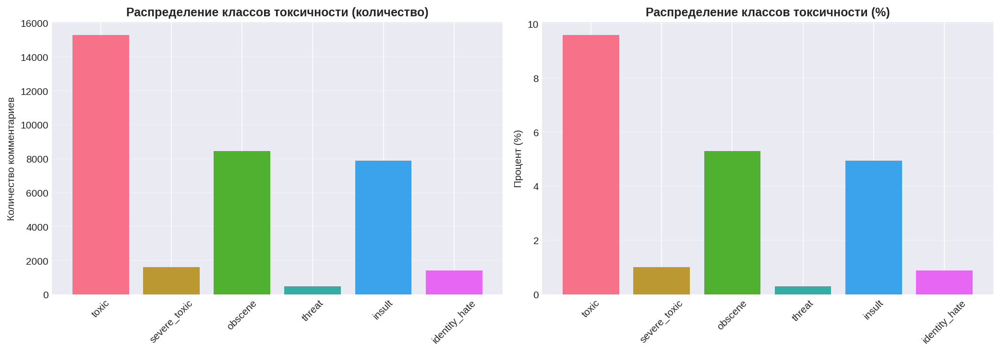
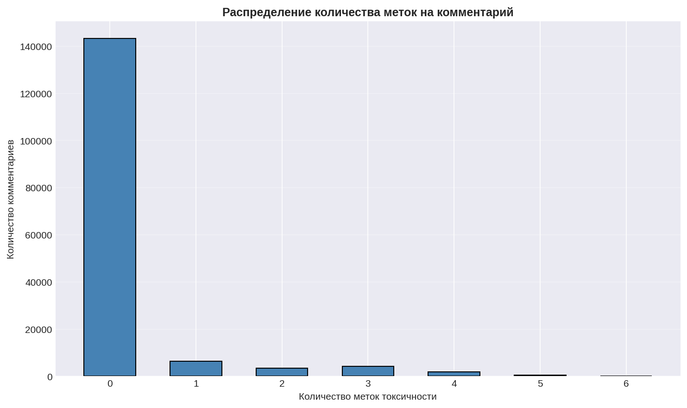
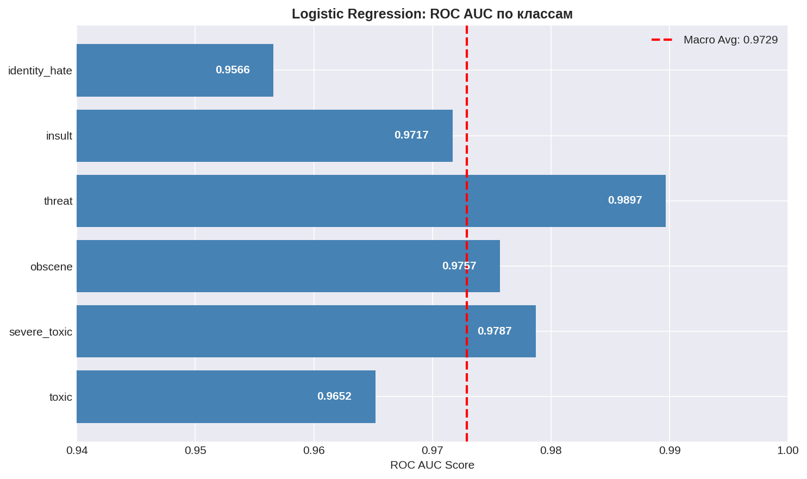
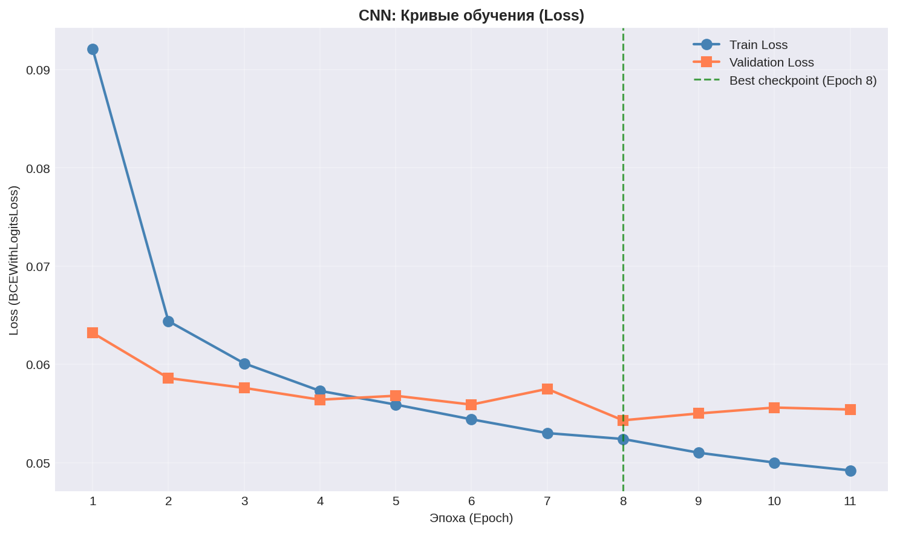
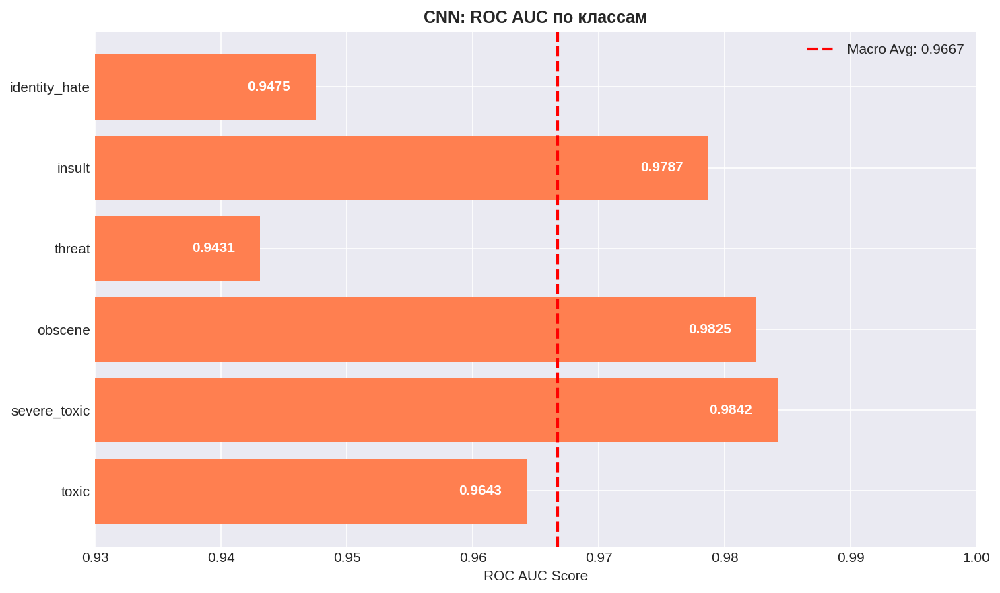
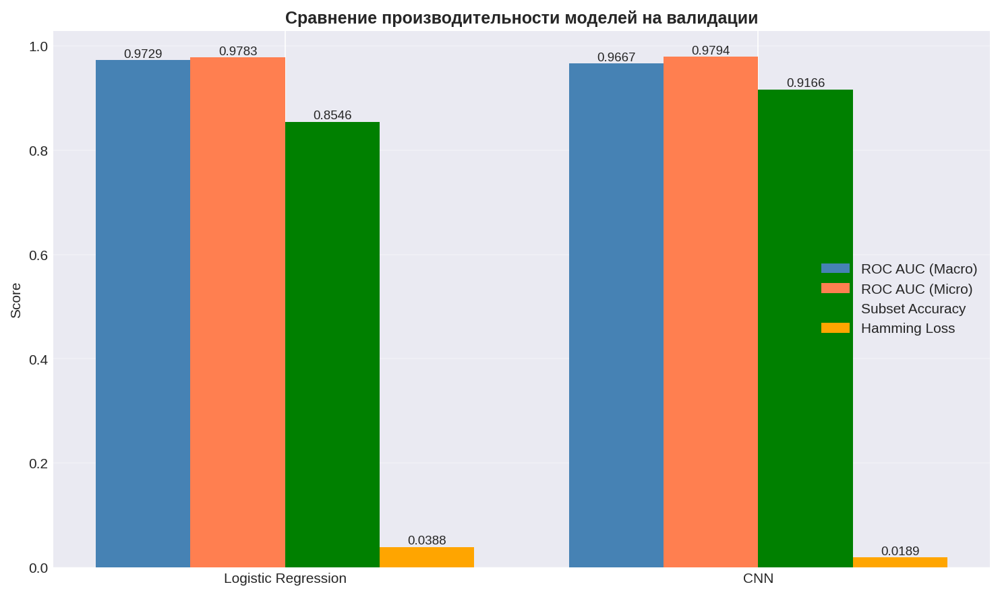

# Классификация Токсичных Комментариев - Kaggle Competition

Полная production-ready решение для многометочной классификации токсичных комментариев с использованием двух подходов: Logistic Regression (TF-IDF) и CNN (1D Convolutional Neural Network).

## 📊 Обзор Проекта

Этот проект реализует две дополняющие друг друга модели машинного обучения для прогнозирования токсичности по 6 независимым классам:

| Класс | Описание |
|-------|---------|
| **toxic** | Общие токсичные комментарии |
| **severe_toxic** | Серьёзная/насильственная токсичность |
| **obscene** | Непристойный язык |
| **threat** | Прямые угрозы |
| **insult** | Оскорбительные комментарии |
| **identity_hate** | Комментарии, направленные на группы людей |

**Тип задачи:** Multi-label классификация (каждый комментарий может принадлежать нескольким классам одновременно)

---

## 📈 Результаты на Валидации

### 📊 Распределение классов в датасете



**Статистика:**
- Всего комментариев в тренировочном наборе: **159,571**
- Чистых комментариев: **143,346 (89.85%)**
- Токсичных комментариев: **16,225 (10.15%)**
- Коэффициент дисбаланса: **32.00x** (от `threat` 478 до `toxic` 15,294)

| Класс | Количество | Процент |
|-------|-----------|---------|
| toxic | 15,294 | 9.58% |
| obscene | 8,449 | 5.29% |
| insult | 7,877 | 4.94% |
| severe_toxic | 1,595 | 1.00% |
| identity_hate | 1,405 | 0.88% |
| **threat** | **478** | **0.30%** |

### 🏷️ Анализ Multi-Label



| Метки на комментарий | Количество | Процент |
|---------------------|-----------|---------|
| 0 (чистые) | 143,346 | 89.85% |
| 1 метка    | 6,360   | 3.99%  |
| 2+ метки   | 3,480   | 6.18% |
| 3+ метки   | 4,209   | 2.18% |
| 4+ метки   | 1,760   | 1.10% |
| 5+ метки   | 385     | 0.24% |
| 6+ метки   | 31      | 0.02% |


---

## 🔧 Архитектура и Подход

### 1️⃣ Logistic Regression с TF-IDF

**Архитектура Pipeline:**
```
Raw Text → Очистка → TF-IDF Векторизация → Logistic Regression → Sigmoid → Вероятности
```

**Гиперпараметры:**
```python
TfidfVectorizer:
  - max_features: 10000 (размер словаря)
  - ngram_range: (1, 2) (сочетание унграмм и биграмм)
  - min_df: 5 (минимум документов)
  - max_df: 0.8 (максимум документов)
  - sublinear_tf: True

LogisticRegression:
  - C: 1.0 (обратная регуляризация)
  - solver: 'lbfgs'
  - class_weight: 'balanced'
```

**Результаты на валидации:**



| Метрика | Значение |
|---------|----------|
| **ROC AUC (Macro)** | **0.9729** ✅ |
| ROC AUC (Micro) | 0.9783 |
| Hamming Loss | 0.0388 |
| Subset Accuracy | 0.8546 |

**Per-Label ROC AUC:**
| Класс | Score |
|-------|-------|
| threat | 0.9897 |
| severe_toxic | 0.9787 |
| obscene | 0.9757 |
| insult | 0.9717 |
| toxic | 0.9652 |
| identity_hate | 0.9566 |

**Достоинства:**
- ⚡ Быстрое обучение и предсказание (< 5 секунд)
- 🔍 Интерпретируемость: можно анализировать веса признаков
- 💾 Низкие требования к памяти
- 📈 Стабильный baseline

---

### 2️⃣ CNN (1D Convolutional Neural Network)

**Архитектура:**
```
Token IDs (последовательность)
        ↓
    Embedding Layer (vocab_size × 100)
        ↓
Parallel Conv1D (kernel_sizes: 2,3,4,5 × 100 filters each)
        ↓
    ReLU Activation
        ↓
Global Max Pooling per filter (→ 400 features)
        ↓
Dropout (p=0.5)
        ↓
Dense 128 + ReLU + Dropout
        ↓
Dense 64 + ReLU + Dropout
        ↓
Output Dense 6 + Sigmoid
        ↓
Class Probabilities [0, 1]
```

**Гиперпараметры:**
```python
Embedding: dim=100
Conv1D: num_filters=100, kernel_sizes=(2,3,4,5)
FC Layers: [128, 64] units
Dropout: p=0.5
Optimizer: Adam(lr=0.001)
Batch size: 32
Max epochs: 20
Early stopping: patience=3 epochs
```

**Процесс обучения:**



| Метрика | Значение |
|---------|----------|
| Эпох пройдено | 11/20 |
| Лучший Validation Loss | 0.0543 (эпоха 8) |
| Финальный Train Loss | 0.0492 |
| Финальный Validation Loss | 0.0554 |

**Результаты на валидации:**



| Метрика | Значение |
|---------|----------|
| **ROC AUC (Macro)** | **0.9667** |
| ROC AUC (Micro) | 0.9794 ✅ |
| Hamming Loss | 0.0189 ✅ |
| Subset Accuracy | 0.9166 ✅ |

**Per-Label ROC AUC:**
| Класс | Score |
|-------|-------|
| severe_toxic | 0.9842 |
| obscene | 0.9825 |
| insult | 0.9787 |
| toxic | 0.9643 |
| identity_hate | 0.9475 |
| threat | 0.9431 |

**Достоинства:**
- 📚 Изучает представления (embeddings)
- 🔗 Захватывает локальные паттерны (n-граммы)
- 📈 Лучше Hamming Loss и Subset Accuracy
- 🎯 Более сложные нелинейные отношения

---

## 📊 Сравнение Моделей



| Метрика | Logistic Regression | CNN |
|---------|-------------------|-----|
| ROC AUC (Macro) | 0.9729 ✅ | 0.9667 |
| ROC AUC (Micro) | 0.9783 | 0.9794 ✅ |
| Subset Accuracy | 0.8546 | 0.9166 ✅ |
| Hamming Loss | 0.0388 | 0.0189 ✅ |
| Время обучения | ~0.5 сек ✅ | ~20 мин |
| Память | Низкая ✅ | Средняя |

**Вывод:**
- **LR лучше** в ROC AUC (Macro) - хороший базовый classifier
- **CNN лучше** в точности на уровне подмножеств (Subset Accuracy) и Hamming Loss
- **Ансамбль** обоих моделей даст лучший результат (В будущем добавится данная модель)

---

## 📂 Структура Проекта

```
toxic_comment_project/
├── README.md                          # Этот файл
├── requirements.txt                   # Зависимости Python
│
├── src/                               # Утилиты
│   ├── __init__.py
│   ├── text_utils.py                 # Очистка текста, токенизация
│   ├── metrics.py                    # Метрики оценки
│   ├── cnn_model.py                  # Архитектура CNN
│   ├── training.py                   # Циклы обучения
│   └── inference.py                  # Предсказание и сабмиссия
│
├── notebooks/                         # Jupyter ноутбуки
│   ├── 01_EDA_Analysis.ipynb         # Exploratory Data Analysis
│   ├── 02_Logistic_Regression.ipynb  # TF-IDF + LogReg
│   └── 03_CNN_Model.ipynb            # PyTorch CNN
│
│
├── data/                              # Данные (локально, не в репо)
│   ├── train.csv                      # Тренировочные данные
│   ├── test.csv                       # Тестовые данные
│   └── sample_submission.csv          # Шаблон сабмиссии
│
└── models/                            # Сохранённые модели
    ├── tfidf_vectorizer.pkl           # TF-IDF трансформер
    ├── logistic_regression_models.pkl # Logistic Regression модели
    └── cnn_model.pt                   # Веса CNN
```

---

## 📝 Формат Данных

### Входные данные (CSV)
```
train.csv:
  - id: ID комментария
  - comment_text: Текст комментария
  - toxic: Бинарная метка (0/1)
  - severe_toxic: Бинарная метка (0/1)
  - obscene: Бинарная метка (0/1)
  - threat: Бинарная метка (0/1)
  - insult: Бинарная метка (0/1)
  - identity_hate: Бинарная метка (0/1)

test.csv:
  - id: ID комментария
  - comment_text: Текст комментария
```

### Выходные данные (Сабмиссия)
```
submission.csv:
  - id: ID комментария
  - toxic: Предсказанная вероятность [0, 1]
  - severe_toxic: Предсказанная вероятность [0, 1]
  - obscene: Предсказанная вероятность [0, 1]
  - threat: Предсказанная вероятность [0, 1]
  - insult: Предсказанная вероятность [0, 1]
  - identity_hate: Предсказанная вероятность [0, 1]
```

---

## 🚀 Установка и Запуск

### 1. Клонирование репозитория
```bash
cd toxic_comment_project
```

### 2. Установка зависимостей
```bash
pip install -r requirements.txt
```

### 3. Подготовка данных
Поместите CSV файлы Kaggle в директорию `data/`:
- `data/train.csv`
- `data/test.csv`
- `data/sample_submission.csv`

### 4. Запуск ноутбуков (в порядке)

```bash
# Запуск Jupyter
jupyter notebook

# Запустите ноутбуки в таком порядке:
# 1. notebooks/01_EDA_Analysis.ipynb (EDA)
# 2. notebooks/02_Logistic_Regression.ipynb (LR)
# 3. notebooks/03_CNN_Model.ipynb (CNN)
```

---

## 🔍 Ключевые детали реализации

### Предобработка текста
```python
# Функция clean_text:
# - Нормализирует пробелы
# - Сохраняет регистр для distinction
```

### Дополнение последовательностей
```python
# max_length = 150 токенов
# Padding/Truncation для CNN
# Статистика длин:
#   - Минимум: 1 токен
#   - Максимум: 1411 токенов
#   - Среднее: 67 токенов
#   - Медиана: 36 токенов
```

### Multi-Label Loss Function
```python
# BCEWithLogitsLoss для многометочной классификации:
# - Применяет sigmoid внутренне
# - Вычисляет binary cross-entropy для каждого класса
# - Каждый класс независим
```

### Early Stopping Strategy
```python
# Обучение CNN:
# - Максимум 20 эпох
# - Patience=3 (остановка, если нет улучшения 3 эпохи)
# - Сохранение best checkpoint
# - Фактически: 11 эпох перед остановкой
```

---

## 📊 Метрики производительности

### Основная метрика: ROC AUC (Macro-Average)

| Метрика | Определение | Почему подходит |
|---------|------------|-----------------|
| **ROC AUC** | Area Under the ROC Curve | Устойчива к дисбалансу классов |
| **Macro-averaging** | Равный вес для всех классов | Хороша для скошенных распределений |
| **Диапазон** | [0, 1] | 0.5=случайность, 1.0=идеальность |

### Дополнительные метрики

| Метрика | Определение |
|---------|------------|
| **Hamming Loss** | Доля неправильно предсказанных меток |
| **Subset Accuracy** | Точное совпадение всех меток (строгая метрика) |
| **Per-class ROC AUC** | Определить сложные классы |
| **Precision/Recall/F1** | Производительность per-класс |

---

## 📈 Статистика Датасета

| Параметр | Значение |
|----------|----------|
| Тренировочный набор | 159,571 комментариев |
| Валидационный набор | 31,915 комментариев (20%) |
| Тестовый набор | 153,164 комментариев |
| Размер словаря (TF-IDF) | 10,000 терминов |
| Размер словаря (CNN) | ~25,000 токенов |
| Max sequence length | 150 токенов |
| Спарсность TF-IDF | 0.42% |

---


## 📋 Примеры из Датасета

### Чистые комментарии:
```
"Oh, don't worry about me, Sandstein. I'm of no strong opinion..."
"Are you trying to dispute that fact?"
"SWOT analysis This source – Align Technology, Inc..."
```

### Токсичные комментарии:
```
Метки: [toxic, obscene]
"Hi! I wanna rape you!"

Метки: [toxic, obscene, threat, insult]
"Terrorize I will terrorise you for as long as you live..."

Метки: [toxic]
"Being blocked So that's your idea of mediation..."
```

---

## 🐛 Troubleshooting

| Проблема | Решение |
|----------|---------|
| **CUDA Out of Memory** | Снизить batch_size (16 или 8), уменьшить max_length |
| **Плохая производительность CNN** | Увеличить epochs, снизить dropout, попробовать разные kernel_sizes |
| **Overfitting** | Увеличить dropout_rate, снизить embedding_dim, добавить early stopping |
| **Underfitting** | Увеличить model capacity, снизить dropout, использовать lower learning rate |

---

## 📚 Ссылки

- [Kaggle Competition](https://www.kaggle.com/competitions/jigsaw-toxic-comment-classification-challenge)

---

## ✨ Особенности реализации

✅ **Качество кода:** PEP-8 compliant, type hints, детальные комментарии  
✅ **Воспроизводимость:** Ясная архитектура, документированные гиперпараметры  
✅ **Модульность:** Отдельные утилиты для лёгкого расширения  
✅ **Production-Ready:** Обработка ошибок, логирование, checkpoint management  

Проект полностью самодостаточен и может быть запущен от начала до конца (от загрузки данных до генерации сабмиссии).
